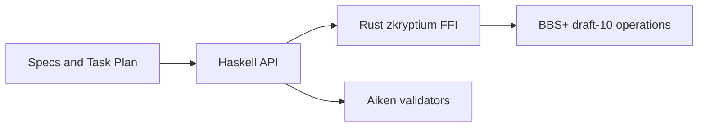

# Architecture

## Overview

The project is split deliberately across three layers:

## Off-Chain Path

The implemented path today is:

1. Haskell constructs typed inputs.
2. Haskell encodes message vectors and disclosure sets into a compact length-delimited frame format for FFI.
3. Rust calls `zkryptium 0.6.1`.
4. Rust returns serialized keys, signatures, and proofs as raw bytes.
5. Haskell wraps those bytes in domain types.

### Why the FFI looks this way

The FFI surface is intentionally byte-oriented:

- fixed-size buffers for secret keys, public keys, and signatures
- framed variable-length buffers for message arrays and disclosure sets
- `bbs_last_error()` for error reporting

This follows the same practical design direction used in other Haskell/Rust FFI code in this workspace: keep the C ABI narrow and stable, keep rich domain logic on the Haskell side.

## On-Chain Path

The Aiken side is still a placeholder architecture rather than the final verifier. The current modules define:

- basic BBS types
- basic BLS aggregate types
- validator entrypoints

The actual cryptographic verification logic is not implemented yet.

## Current Constraints

- The repo can prove off-chain interoperability with imported fixtures.
- It cannot yet prove off-chain to on-chain equivalence.
- The validator blueprint exists, but the semantics are still stubbed.
