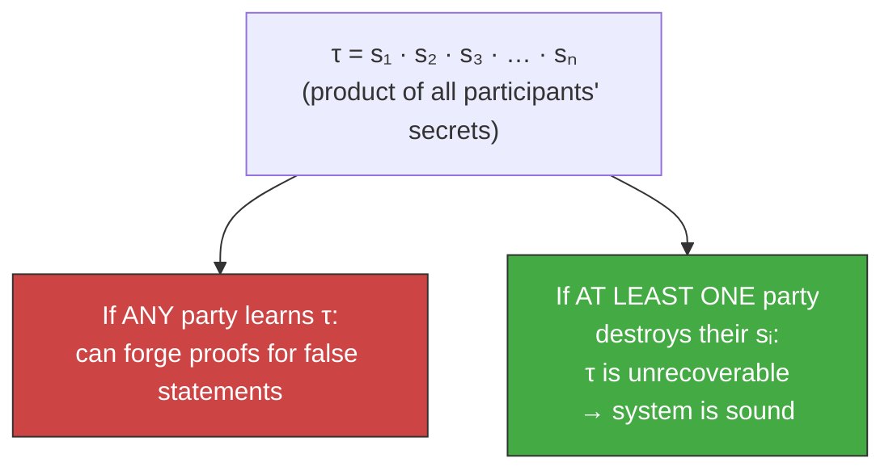
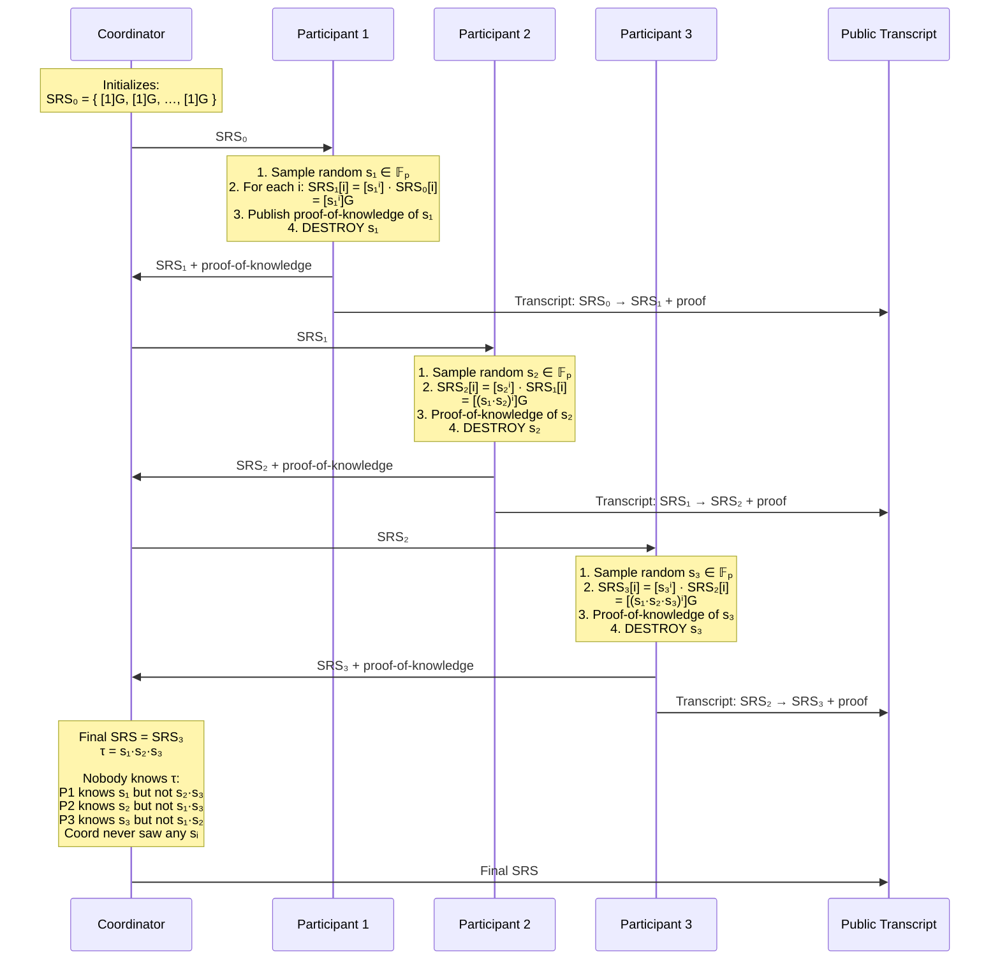
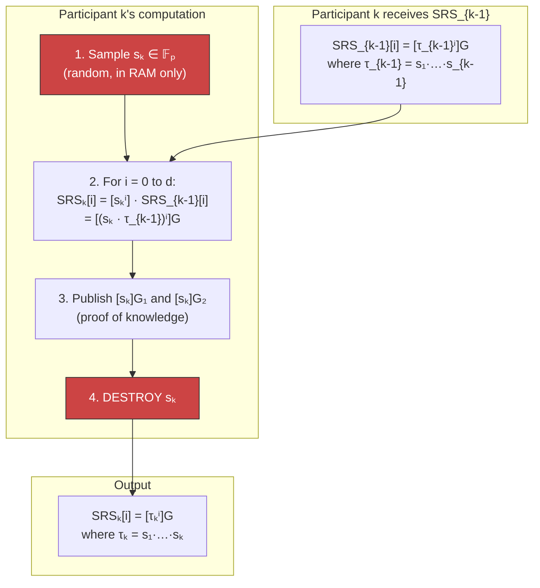
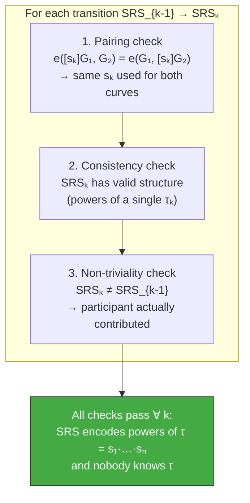
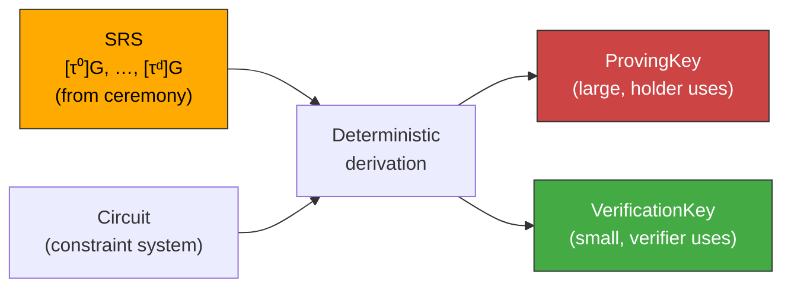
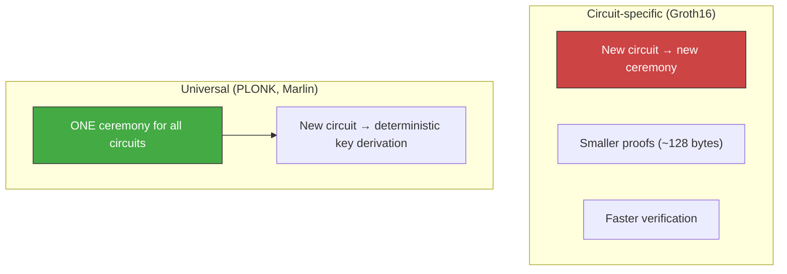

# Trusted Setup Ceremony

How zk-SNARK systems produce their proving and verification keys
without anyone learning the secret that would allow forging proofs.

!!! info "BBS+ does NOT need a ceremony"
    The BBS+ scheme used in `cardano-bbs` works with direct key
    generation (`generateKeyPair`). No ceremony is required.

    This page documents the ceremony concept because:

    - The future on-chain verifier may use zk-SNARKs for predicate
      proofs ("age ≥ 18") on top of BBS+ disclosed attributes
    - Understanding the ceremony clarifies the broader ZK landscape
    - It explains a key advantage of BBS+: simpler trust assumptions

---

## Why some ZK systems need a ceremony

zk-SNARKs (Groth16, PLONK) require a **Structured Reference String
(SRS)** — encoded powers of a secret value τ on an elliptic curve:

```
[τ⁰]G,  [τ¹]G,  [τ²]G,  …,  [τᵈ]G
```

Whoever knows τ can forge proofs for any statement. The ceremony
ensures τ is collectively constructed such that **no single party**
(and no colluding subset short of all parties) ever learns it.



---

## The ceremony protocol

The ceremony is sequential. Each participant takes the previous
output, mixes in their own secret, and passes it forward.

### Participants

| Role | Who | What they do |
|------|-----|-------------|
| Coordinator | A server or smart contract | Sequences contributions, publishes results |
| Participant 1…N | Anyone — researchers, companies, volunteers | Each contributes one secret sᵢ |
| Observers | Anyone | Verify each contribution is well-formed |

No participant trusts any other. The coordinator is **not trusted** —
it only sequences contributions.

### Step by step



### What each participant computes



---

## Verification by observers

Anyone can verify the ceremony after the fact:



---

## From SRS to keys

The SRS is circuit-independent. To get circuit-specific keys, a
deterministic transformation combines the SRS with the circuit:



This step is **deterministic and public** — no secrets, no ceremony.

---

## What can go wrong

| Threat | Outcome | Mitigation |
|--------|---------|-----------|
| ALL participants collude | Can reconstruct τ, forge proofs | Run ceremony with hundreds+ participants |
| Coordinator tampers | Detected by transcript verification | Public transcript, anyone can verify |
| Participant uses sᵢ = 1 | Proof-of-knowledge fails | Checked by observers |
| Participant drops out | Ceremony continues | Security unaffected |

---

## Universal vs. circuit-specific setup



---

## Transparent setup (no ceremony)

Some systems eliminate the ceremony entirely:

| | SNARKs (ceremony) | STARKs (transparent) | BBS+ |
|---|---|---|---|
| Setup | Multi-party ceremony | None (hash params) | None (direct keygen) |
| Trust | 1-of-N honest | Hash collision-resistance | Issuer key authenticity |
| Proof size | ~128–256 bytes | ~50–200 KB | ~300 bytes |
| Verification | Fast (pairings) | Slower (hash chains) | Fast (pairings) |
| Predicate proofs | Yes (any circuit) | Yes (any circuit) | No (disclosure only) |
| Post-quantum | No | Yes | No |

BBS+ sits in a sweet spot for selective disclosure: no ceremony,
small proofs, fast verification — but limited to "reveal or hide"
decisions on signed attributes. For arbitrary predicates ("age ≥ 18"
without revealing age), a SNARK layer is needed on top.
