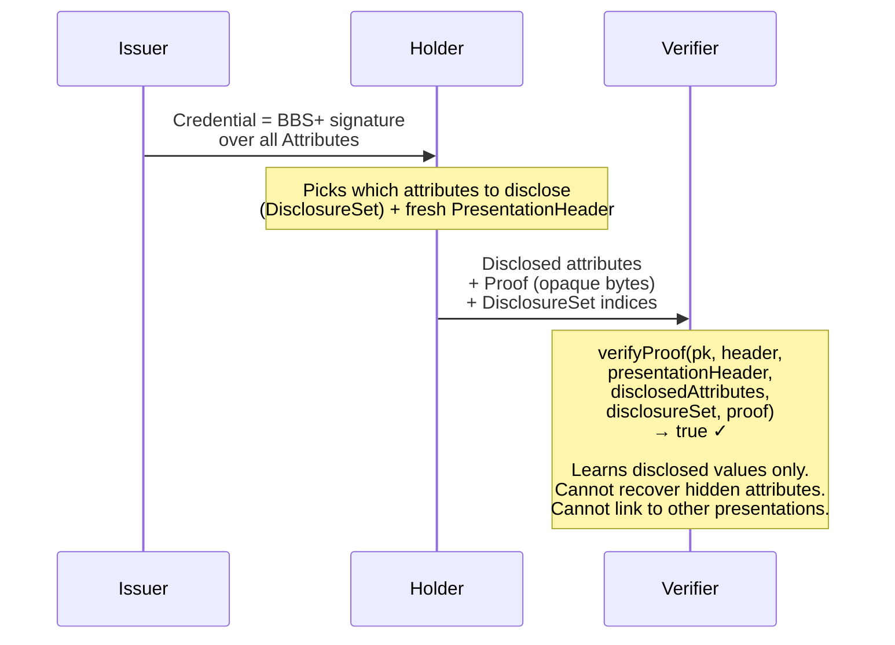
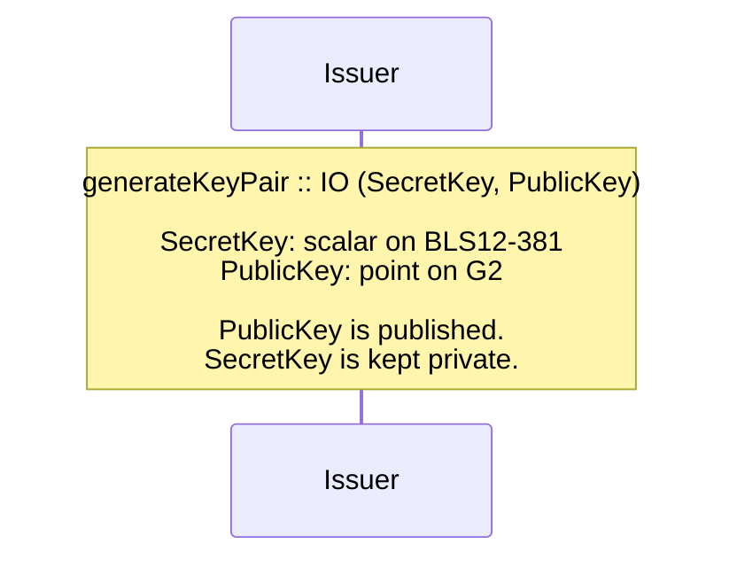
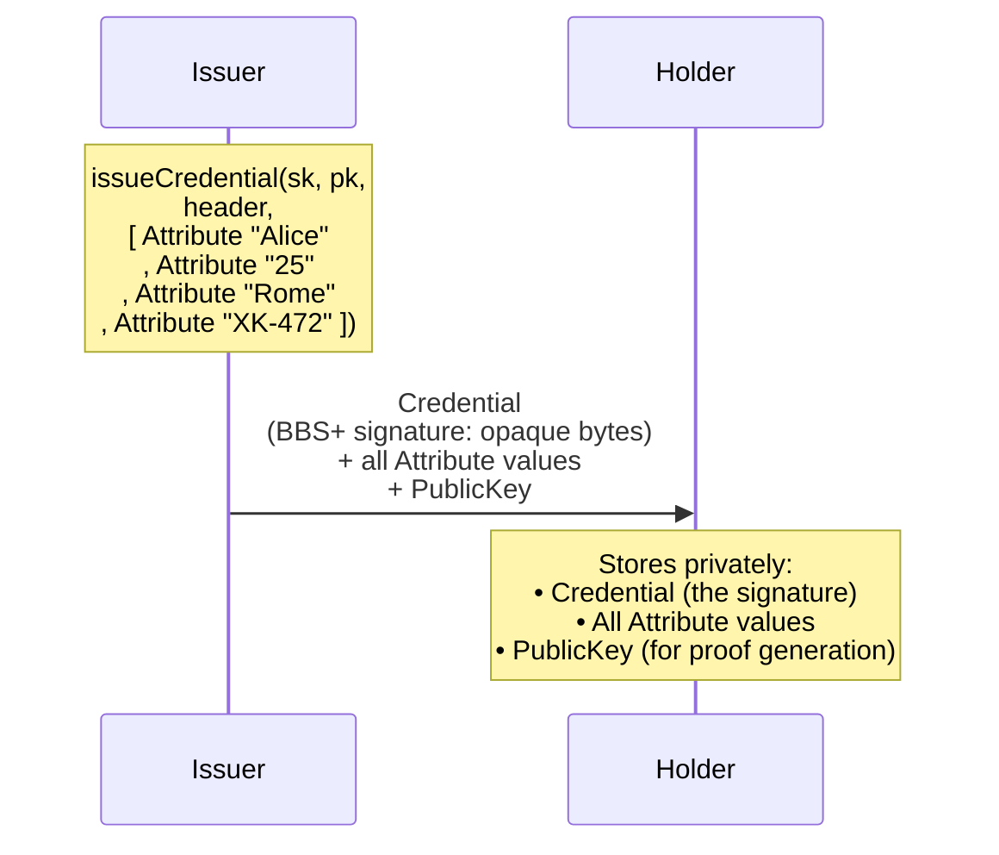
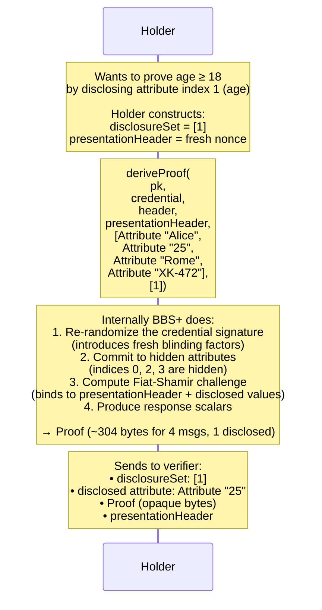
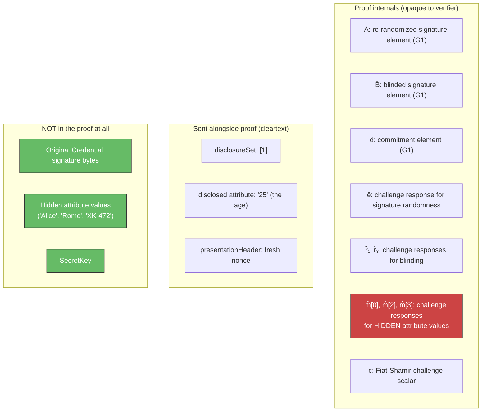
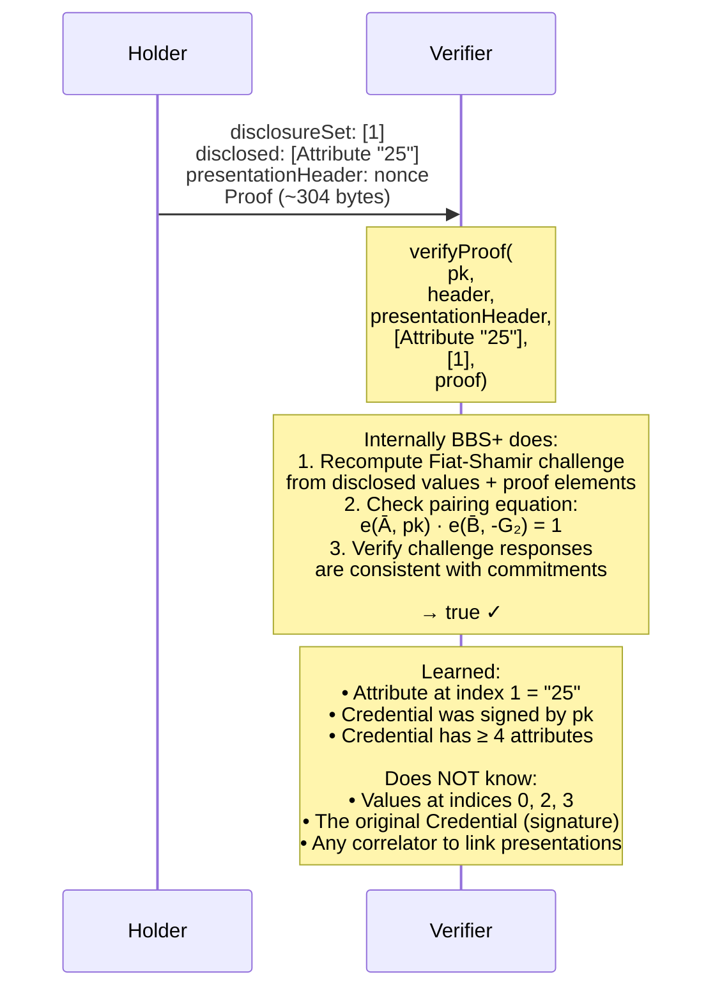
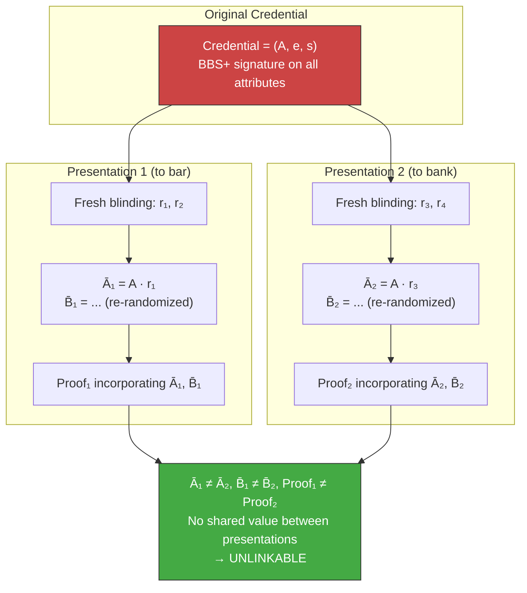

# ZK Selective Disclosure

How BBS+ lets a holder prove facts about their credentials without
revealing the credentials themselves — or letting verifiers link
presentations to the same holder.

!!! note "Mapping to cardano-bbs API"
    The concepts below map directly to the Haskell API in this repo:

    | Concept | cardano-bbs type |
    |---------|-----------------|
    | Issuer secret | `SecretKey` |
    | Issuer public key | `PublicKey` |
    | Credential (signed attributes) | `Credential` |
    | Attribute value | `Attribute` |
    | Which attributes to reveal | `DisclosureSet` ([Int]) |
    | ZK proof | `Proof` |
    | Presentation nonce | `PresentationHeader` |

---

## The idea in one diagram



---

## Data structures

### Credential attributes

A credential is an ordered list of `Attribute` values.
The issuer signs all of them together with a single BBS+ signature.

```haskell
-- In cardano-bbs:
issueCredential :: SecretKey -> PublicKey -> Maybe Header -> [Attribute] -> IO Credential
```

For example, a government ID credential might contain:

| Index | Attribute |
|-------|----------|
| 0 | name = "Alice" |
| 1 | age = "25" |
| 2 | address = "Rome" |
| 3 | id = "XK-472" |

The `Credential` is the BBS+ signature over this entire list.

### Disclosure set

A `DisclosureSet` is a list of indices selecting which attributes to reveal:

| DisclosureSet | What verifier sees |
|--------------|-------------------|
| `[1]` | age = "25" (index 1 only) |
| `[0, 2]` | name = "Alice", address = "Rome" |
| `[]` | Nothing (pure existence proof) |
| `[0,1,2,3]` | Everything (no privacy) |

### Proof

The `Proof` is an opaque byte string (~300–400 bytes depending on
hidden attribute count). It contains no cleartext attribute values
and no issuer signature bytes.

```haskell
-- Proof size formula:
proofBytes totalMessages disclosedCount =
  272 + 32 * max 0 (totalMessages - disclosedCount)
```

Each proof incorporates a fresh `PresentationHeader` (holder nonce),
making every proof unique even for the same credential and disclosure set.

---

## Protocol phases

### Phase 1 — Key generation

The issuer generates a BBS+ key pair on the BLS12-381 curve.



!!! info "No trusted setup ceremony needed"
    BBS+ uses **pairing-based** cryptography on BLS12-381 but does **not**
    require a multi-party trusted setup ceremony. The issuer generates
    keys directly. This is different from zk-SNARKs (Groth16, PLONK)
    which need a ceremony to produce a Structured Reference String.
    See [Trusted Setup Ceremony](zk-ceremony.md) for the SNARK case.

### Phase 2 — Credential issuance

The issuer signs the holder's attributes.



The `Credential` is a BBS+ signature — a single compact value
(~112 bytes) that commits to **all** attributes simultaneously.

### Phase 3 — Proof generation (selective disclosure)

The holder reveals only chosen attributes and generates a ZK proof
for the rest.



#### What the proof contains vs. what it hides



### Phase 4 — Verification

The verifier checks the proof using only the disclosed attributes
and the issuer's public key.



---

## Unlinkability: the BBS+ mechanism

Unlike generic zk-SNARKs where unlinkability comes from circuit randomness,
BBS+ achieves it through **signature re-randomization**.



The `PresentationHeader` (holder nonce) is mixed into the Fiat-Shamir
challenge, adding an additional source of uniqueness per presentation.

---

## Comparison with the Lean spec

The [Lean 4 specification](https://github.com/lambdasistemi/cardano-bbs/blob/main/lean/ZkSelectiveDisclosure.lean)
models a generic ZK selective disclosure system. Here is how it maps
to the BBS+ specifics in this repo:

| Lean spec | BBS+ (cardano-bbs) |
|-----------|-------------------|
| `SecretKey` | `SecretKey` (BLS12-381 scalar) |
| `PublicKey` | `PublicKey` (G2 point) |
| `Credential` (attribute record) | `[Attribute]` (ordered list) |
| `CredentialWitness.issuerSig` | `Credential` (BBS+ signature) |
| `Circuit` | Implicit — BBS+ has one fixed verification equation |
| `ProvingKey` / `VerificationKey` | Not needed — BBS+ uses `PublicKey` directly |
| `trustedSetup` ceremony | Not needed — key generation is direct |
| `Randomness` → `prove()` | Fresh blinding factors + `PresentationHeader` |
| `Proof pubInputs` | `Proof` (~300 bytes) |
| `ZkPresentation.publicInputs` | Disclosed `[Attribute]` + `DisclosureSet` + `PresentationHeader` |
| `verify(vk, pubInputs, proof)` | `verifyProof(pk, header, ph, attrs, ds, proof)` |

The key simplification in BBS+ compared to generic zk-SNARKs:
no circuits, no trusted setup, no proving/verification key distinction.
The issuer's `PublicKey` serves all roles.

The tradeoff: BBS+ can only prove "these attributes are signed by this
issuer" with selective disclosure. It cannot prove arbitrary predicates
like "age ≥ 18" without revealing the age. For predicate proofs, you
need a zk-SNARK layer on top — which is what the on-chain Aiken
verifier will eventually provide.
