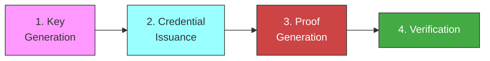
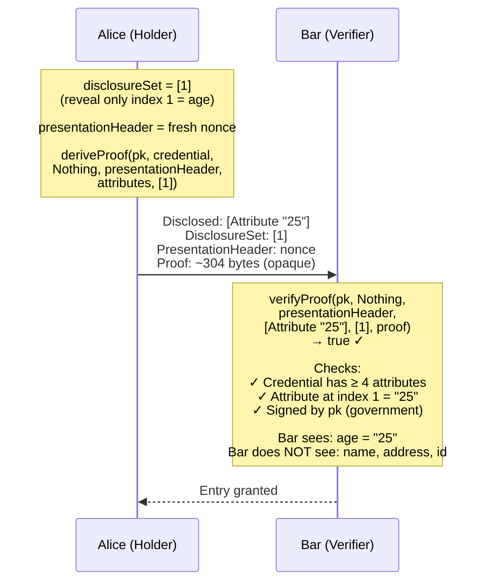
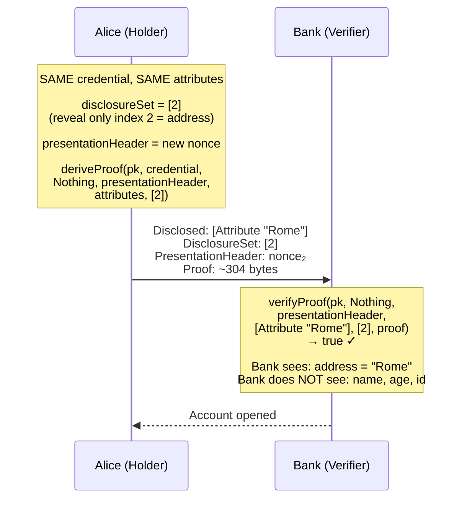
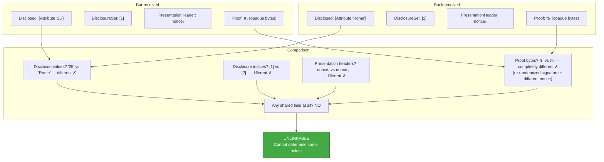
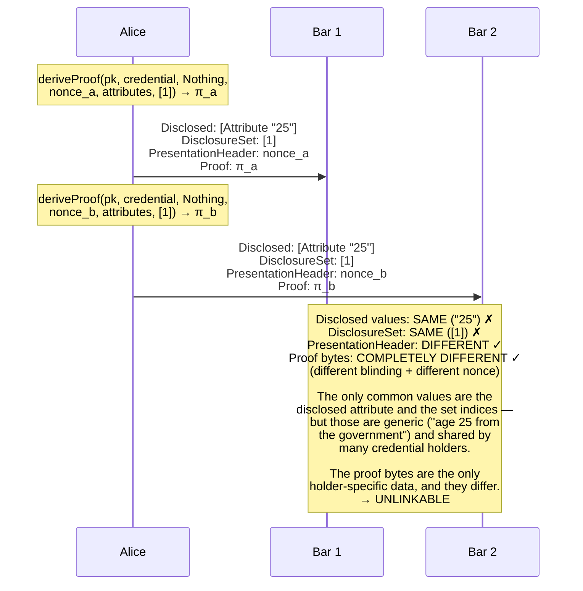
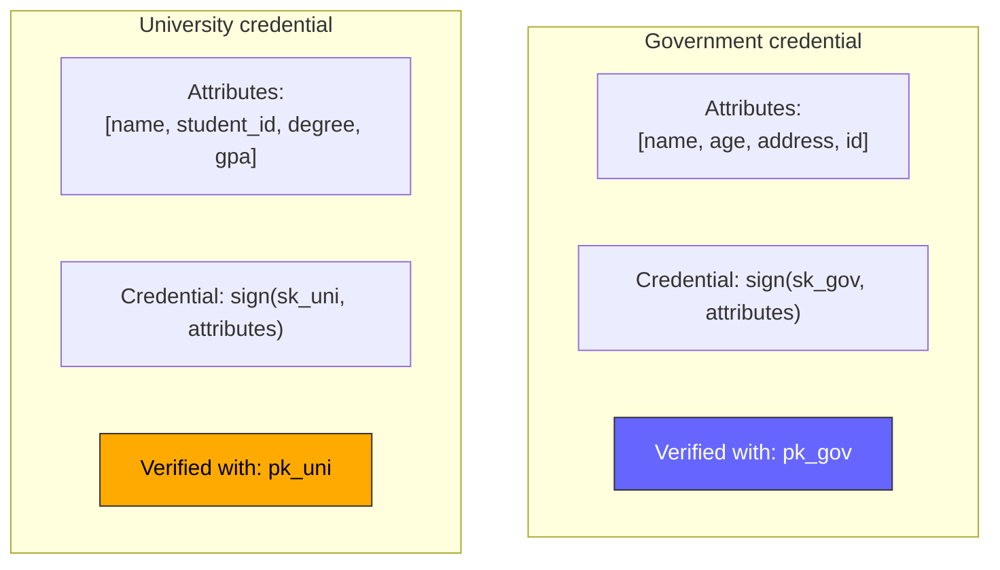
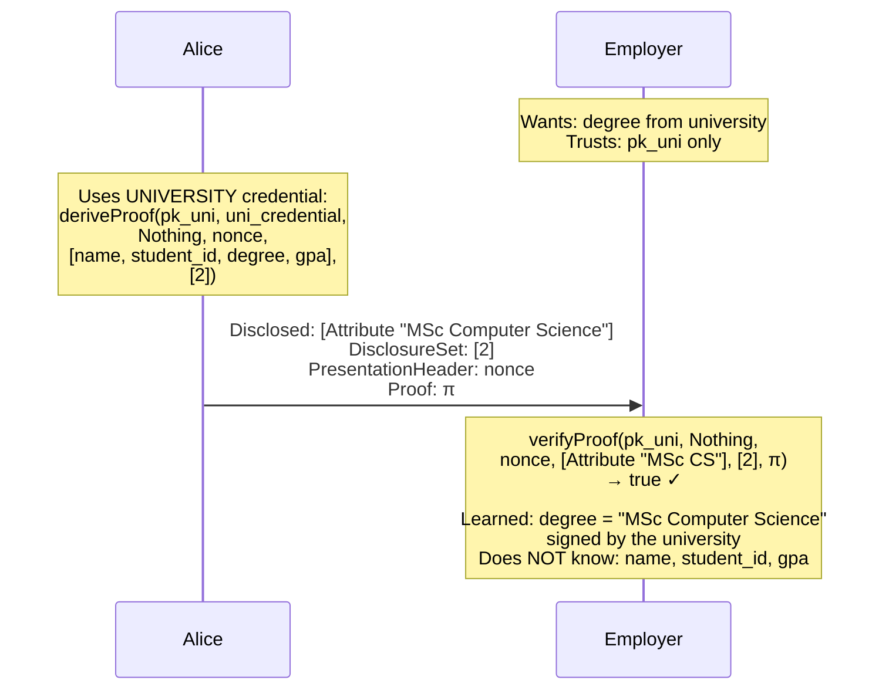
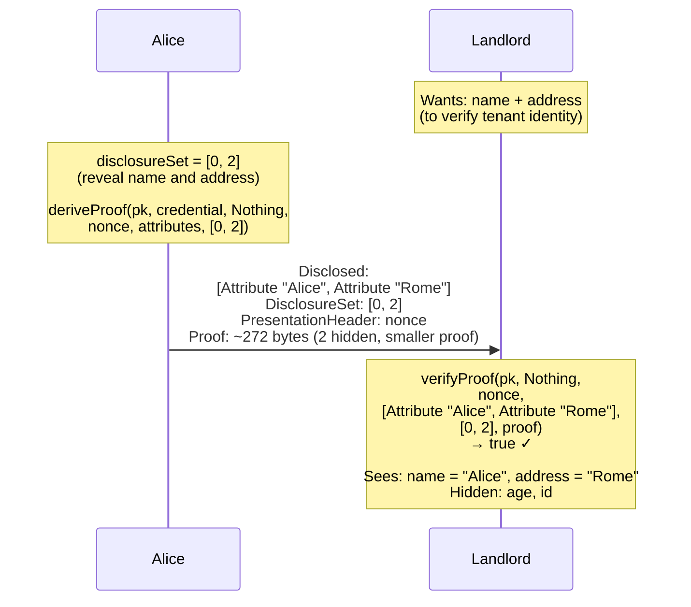
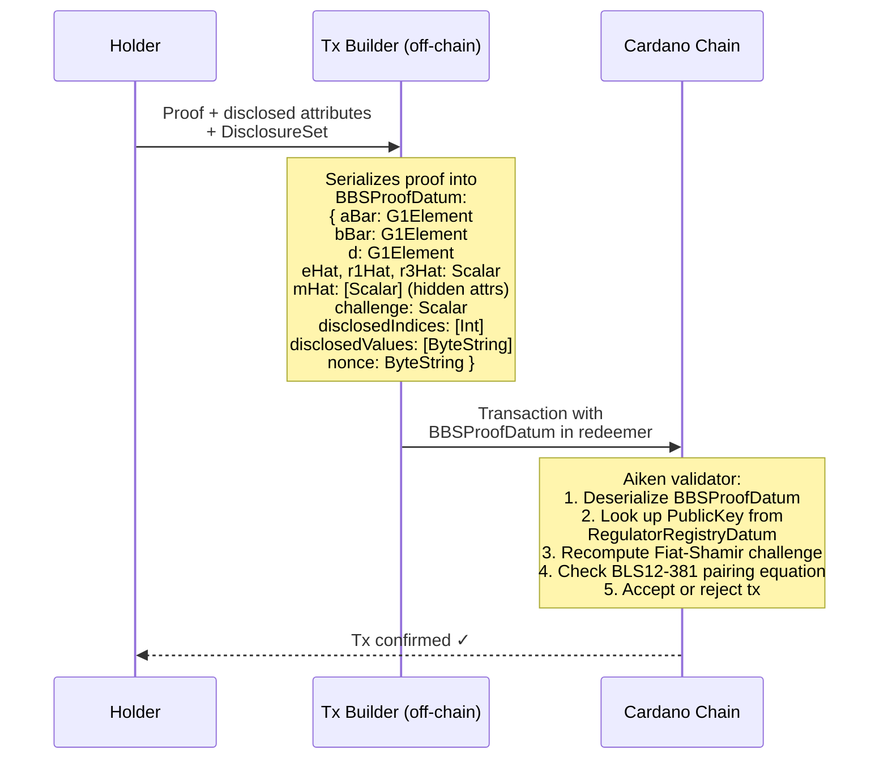
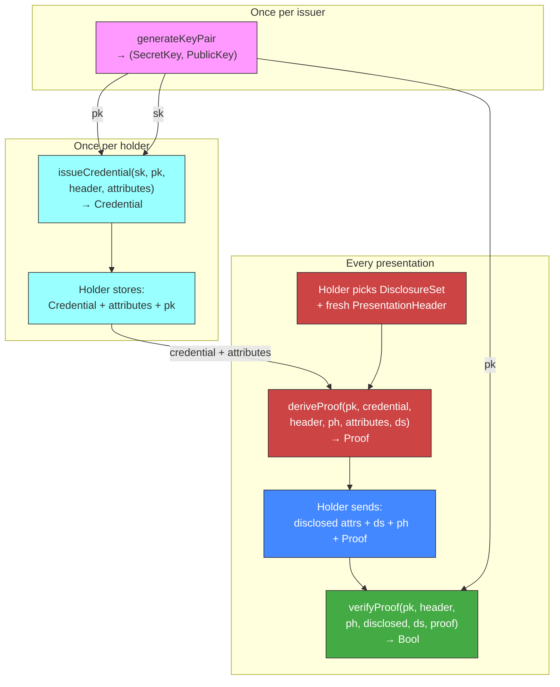

# Use Cases

Concrete scenarios showing the full BBS+ selective disclosure flow,
mapped to the `cardano-bbs` Haskell API.

---

## Phase overview

Every use case follows the same four phases:



| Phase | Who | API call | Frequency |
|-------|-----|----------|-----------|
| 1. Key Generation | Issuer | `generateKeyPair` | Once per issuer |
| 2. Issuance | Issuer → Holder | `issueCredential(sk, pk, header, attributes)` | Once per holder |
| 3. Proof | Holder | `deriveProof(pk, cred, header, ph, attrs, ds)` | Every presentation |
| 4. Verify | Verifier | `verifyProof(pk, header, ph, attrs, ds, proof)` | Every presentation |

---

## Use Case 1: Age verification at a bar

Alice (25) wants to enter a bar. The bar needs to see her age but
must not learn her name, address, or ID number.

### Setup

```haskell
-- Issuer (government) has:
(sk, pk) <- generateKeyPair

-- Credential attributes:
attributes =
  [ Attribute "Alice"    -- index 0: name
  , Attribute "25"       -- index 1: age
  , Attribute "Rome"     -- index 2: address
  , Attribute "XK-472"   -- index 3: id
  ]

-- Issuance (once):
credential <- issueCredential sk pk Nothing attributes
-- Holder stores: credential, attributes, pk
```

### Presentation



---

## Use Case 2: Address proof for a bank

Alice opens a bank account. The bank needs proof she lives in Rome.
Same credential, different disclosure.



---

## Use Case 3: Unlinkability — bar and bank collude

The bar and the bank compare notes. Can they tell it was the same person?



**Why it works:** The `Credential` (BBS+ signature) is re-randomized
with fresh blinding factors inside `deriveProof`. The `PresentationHeader`
nonce is mixed into the Fiat-Shamir challenge. Together, these ensure
that no stable value appears in both presentations.

---

## Use Case 4: Same disclosure to two bars

Alice visits two bars on the same night. Both require age disclosure.
Same credential, same attributes, same disclosure set — only the
`PresentationHeader` nonce differs.



!!! warning "Disclosed values can be a soft correlator"
    If the disclosed attribute is highly unique (e.g., a rare name or
    an unusual age), verifiers might guess the same holder. BBS+
    prevents *cryptographic* linkability but cannot prevent
    *statistical* inference from the disclosed values themselves.
    Minimize disclosure to reduce this risk.

---

## Use Case 5: Multiple issuers

Alice has credentials from two issuers:

- **Government** (pk_gov): name, age, address, id
- **University** (pk_uni): name, student_id, degree, gpa

Each credential is signed with a different `SecretKey` and verified
with a different `PublicKey`.





The verifier decides which `PublicKey` to trust. If Alice presents
a government credential to an employer who only trusts the university,
the employer simply rejects the `PublicKey` — the proof itself would
still be valid, but the trust anchor is wrong.

---

## Use Case 6: Multi-attribute disclosure

Sometimes the verifier needs more than one attribute. The holder
controls exactly which combination to reveal.



Note the proof is smaller (~272 bytes) because fewer attributes are
hidden. The formula:

```
proof_size = 272 + 32 × max(0, total_attributes − disclosed_count)
```

| Disclosed | Hidden | Proof size |
|-----------|--------|-----------|
| 1 of 4 | 3 | 368 bytes |
| 2 of 4 | 2 | 336 bytes |
| 3 of 4 | 1 | 304 bytes |
| 4 of 4 | 0 | 272 bytes |

---

## Use Case 7: On-chain verification (future)

The Aiken on-chain verifier (not yet implemented) will verify BBS+
proofs as part of Cardano transaction validation.



This enables **privacy-preserving compliance on-chain**: a transaction
can prove a credential fact (e.g., "holder is KYC'd") without revealing
the holder's identity to anyone reading the chain.

---

## Lifecycle summary


